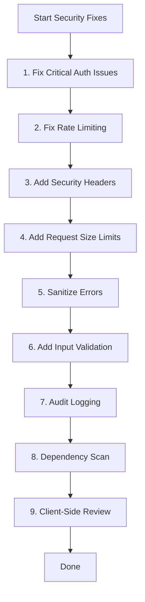

# Hospital Website Security Fix Plan

## Executive Summary

This document outlines a comprehensive security improvement plan for the Shivaji Hospital Website. Based on the codebase analysis, several critical security vulnerabilities have been identified that require immediate attention.

---

## Current Security Status

### ✅ Already Protected Routes (Authentication in Place)
| Route | Methods | Protection |
|-------|---------|------------|
| [`src/app/api/admin/appointments/route.js`](src/app/api/admin/appointments/route.js) | GET | requireRole(['admin','doctor','receptionist']) |
| [`src/app/api/admin/doctors/route.js`](src/app/api/admin/doctors/route.js) | GET, POST | requireRole |
| [`src/app/api/admin/services/route.js`](src/app/api/admin/services/route.js) | GET, POST | requireRole |
| [`src/app/api/admin/settings/route.js`](src/app/api/admin/settings/route.js) | PUT | requireRole(['admin']) |
| [`src/app/api/admin/reviews/route.js`](src/app/api/admin/reviews/route.js) | GET, PATCH | requireRole(['admin']) |
| [`src/app/api/appointments/[id]/route.js`](src/app/api/appointments/[id]/route.js) | GET, PATCH, DELETE | requireRole |
| [`src/app/api/patients/[id]/route.js`](src/app/api/patients/[id]/route.js) | GET, PATCH, DELETE | requireRole |
| [`src/app/api/patients/route.js`](src/app/api/patients/route.js) | GET, POST | requireRole |
| [`src/app/api/doctors/[id]/route.js`](src/app/api/doctors/[id]/route.js) | PATCH, DELETE | requireRole(['admin']) |
| [`src/app/api/medical-records/route.js`](src/app/api/medical-records/route.js) | GET, POST | requireRole |

### ❌ UNPROTECTED Routes (CRITICAL - Require Immediate Fix)

| Priority | Route | Methods | Issue | Files to Modify |
|----------|-------|---------|-------|-----------------|
| **CRITICAL** | [`src/app/api/admin/appointments/[id]/route.js`](src/app/api/admin/appointments/[id]/route.js) | DELETE | No authentication - allows anyone to delete ANY appointment | Add `requireRole` to DELETE |
| **CRITICAL** | [`src/app/api/admin/doctors/[id]/route.js`](src/app/api/admin/doctors/[id]/route.js) | PUT, DELETE | No authentication - allows anyone to modify/delete doctors | Add `requireRole` to PUT, DELETE |
| **CRITICAL** | [`src/app/api/admin/services/[id]/route.js`](src/app/api/admin/services/[id]/route.js) | PUT, DELETE | No authentication - allows anyone to modify/delete services | Add `requireRole` to PUT, DELETE |
| **HIGH** | [`src/app/api/appointments/admin-save/route.js`](src/app/api/appointments/admin-save/route.js) | POST | No authentication - uses admin client directly, allows creating/updating appointments without auth | Add authentication or remove this endpoint |

---

## Prioritized Security Fixes

### 🔴 PRIORITY 1: Critical Vulnerabilities (Fix Immediately)

#### 1.1 Add Authentication to [id] Admin Routes

**Files to modify:**
- [`src/app/api/admin/appointments/[id]/route.js`](src/app/api/admin/appointments/[id]/route.js) - Add `requireRole` to DELETE
- [`src/app/api/admin/doctors/[id]/route.js`](src/app/api/admin/doctors/[id]/route.js) - Add `requireRole` to PUT, DELETE
- [`src/app/api/admin/services/[id]/route.js`](src/app/api/admin/services/[id]/route.js) - Add `requireRole` to PUT, DELETE

**Solution:**
```javascript
// Add at the start of each handler
const { user, response: authError } = await requireRole(request, ['admin']);
if (authError) return authError;
```

**Effort:** Small (~10 min per file)

---

#### 1.2 Fix Serverless Rate Limiting

**File to modify:** [`src/utils/rateLimit.js`](src/utils/rateLimit.js)

**Current issue:** In-memory Map doesn't persist across serverless function invocations

**Recommended solutions (in order of preference):**

| Option | Service | Effort | Cost |
|--------|---------|--------|------|
| 1. Use Vercel KV | Vercel Redis | Medium | Free tier available |
| 2. Use Upstash Redis | Upstash | Medium | Free tier available |
| 3. Use Cloudflare | Cloudflare Workers | Medium | Free tier available |
| 4. Use third-party service | RateLimit.io, etc. | Small | Paid |

**Implementation approach:**
```javascript
// Example: Using Upstash Redis
import { Redis } from '@upstash/redis';

const redis = new Redis({
  url: process.env.UPSTASH_REDIS_REST_URL,
  token: process.env.UPSTASH_REDIS_REST_TOKEN,
});

export async function checkRateLimit(ip, maxRequests = 10, windowMs = 60000) {
  const key = `ratelimit:${ip}`;
  const current = await redis.incr(key);
  if (current === 1) {
    await redis.expire(key, Math.ceil(windowMs / 1000));
  }
  return { allowed: current <= maxRequests, remaining: Math.max(0, maxRequests - current) };
}
```

**Effort:** Medium

---

#### 1.3 Review/Remove Unauthenticated admin-save Endpoint

**File to modify:** [`src/app/api/appointments/admin-save/route.js`](src/app/api/appointments/admin-save/route.js)

**Issue:** This endpoint has NO authentication and uses supabaseAdmin directly. It appears to be a duplicate of the protected `/api/admin/appointments` endpoint.

**Recommended actions:**
1. Add authentication if the endpoint is needed
2. Or remove it if duplicate functionality exists elsewhere
3. Or ensure it's only called from trusted internal sources

**Effort:** Small

---

### 🟠 PRIORITY 2: High Priority Security Improvements

#### 2.1 Add Security Headers

**File to modify:** [`next.config.mjs`](next.config.mjs)

**Required headers:**
- Content-Security-Policy (CSP)
- X-Frame-Options
- X-Content-Type-Options
- Referrer-Policy
- Strict-Transport-Security

**Implementation:**
```javascript
/** @type {import('next').NextConfig} */
const nextConfig = {
  async headers() {
    return [
      {
        source: '/:path*',
        headers: [
          {
            key: 'Content-Security-Policy',
            value: "default-src 'self'; script-src 'self' 'unsafe-inline' 'unsafe-eval'; style-src 'self' 'unsafe-inline' https://fonts.googleapis.com; font-src 'self' https://fonts.gstatic.com; img-src 'self' data: blob: https://*.supabase.co https://*.google.com; connect-src 'self' https://*.supabase.co;"
          },
          {
            key: 'X-Frame-Options',
            value: 'DENY'
          },
          {
            key: 'X-Content-Type-Options',
            value: 'nosniff'
          },
          {
            key: 'Referrer-Policy',
            value: 'strict-origin-when-cross-origin'
          },
          {
            key: 'Strict-Transport-Security',
            value: 'max-age=31536000; includeSubDomains'
          }
        ]
      }
    ];
  }
};

export default nextConfig;
```

**Effort:** Small

---

#### 2.2 Add Request Size Limits

**Implementation:** Add body parser limits in route handlers or use Next.js configuration

**File to modify:** [`next.config.mjs`](next.config.mjs)

```javascript
const nextConfig = {
  api: {
    bodyParser: {
      sizeLimit: '1mb',
    },
  },
  // ... headers config
};
```

**Effort:** Small

---

#### 2.3 Add Audit Logging to Unprotected Endpoints

**Files to check:**
- [`src/app/api/admin/appointments/[id]/route.js`](src/app/api/admin/appointments/[id]/route.js) - After adding auth
- [`src/app/api/admin/doctors/[id]/route.js`](src/app/api/admin/doctors/[id]/route.js) - After adding auth
- [`src/app/api/admin/services/[id]/route.js`](src/app/api/admin/services/[id]/route.js) - After adding auth

**Add logging pattern:**
```javascript
import { logAction } from '@/utils/auditLog';

// After successful auth
await logAction(user.id, 'deleted_appointment', id, 'appointments');
```

**Effort:** Small

---

### 🟡 PRIORITY 3: Medium Priority Security Improvements

#### 3.1 Sanitize Error Messages

**Files to review for information leakage:**
- All route.js files that return `error.message` directly

**Common issue:** Database errors are returned directly to clients, potentially exposing:
- Table names
- Column names
- Internal system paths
- Database version info

**Solution:** Replace specific errors with generic messages in production:
```javascript
// Instead of:
return NextResponse.json({ success: false, error: error.message }, { status: 400 });

// Use:
const isProduction = process.env.NODE_ENV === 'production';
return NextResponse.json({ 
  success: false, 
  error: isProduction ? 'An error occurred. Please try again.' : error.message 
}, { status: 400 });
```

**Effort:** Medium (requires reviewing all routes)

---

#### 3.2 Add Input Validation to Remaining Endpoints

**Files needing validation review:**
- [`src/app/api/admin/doctors/[id]/route.js`](src/app/api/admin/doctors/[id]/route.js) - PUT needs validation
- [`src/app/api/admin/services/[id]/route.js`](src/app/api/admin/services/[id]/route.js) - PUT needs validation
- [`src/app/api/appointments/admin-save/route.js`](src/app/api/appointments/admin-save/route.js) - POST needs validation

**Effort:** Small

---

#### 3.3 Review Client-Side Data Exposure

**Files to review:**
- [`src/app/admin/dashboard/page.js`](src/app/admin/dashboard/page.js)
- [`src/app/book-appointment/page.js`](src/app/book-appointment/page.js)

**Check for:**
- Sensitive data in console.log statements
- API keys or tokens exposed in client-side code
- Patient information displayed without proper masking

**Effort:** Medium

---

### 🟢 PRIORITY 4: Lower Priority Improvements

#### 4.1 Dependency Vulnerability Scan

**Current dependencies in [`package.json`](package.json):**
```
@supabase/supabase-js: ^2.98.0
@vercel/analytics: ^1.6.1
firebase: ^12.10.0
jspdf: ^4.1.0
next: ^16.1.6
react: 19.2.0
react-dom: 19.2.0
```

**Recommended actions:**
```bash
npm audit
npm audit fix
```

**Note:** Check for known vulnerabilities in:
- firebase (older versions had XSS issues)
- jspdf (has had security issues in past)

**Effort:** Small

---

#### 4.2 Add CSRF Protection

**Current state:** Next.js has built-in CSRF protection for mutations when using cookies properly. The current implementation uses Bearer tokens, which is acceptable.

**If needed:** Consider using SameSite cookies for authentication instead of Bearer tokens.

**Effort:** Medium

---

## Security Headers Quick Reference

| Header | Recommended Value | Purpose |
|--------|-------------------|---------|
| Content-Security-Policy | `default-src 'self'` | Prevents XSS/injection |
| X-Frame-Options | `DENY` | Prevents clickjacking |
| X-Content-Type-Options | `nosniff` | Prevents MIME sniffing |
| Referrer-Policy | `strict-origin-when-cross-origin` | Controls referrer info |
| Strict-Transport-Security | `max-age=31536000` | Enforces HTTPS |

---

## Recommended Execution Order



---

## Summary

| Priority | Items | Estimated Effort |
|----------|-------|------------------|
| Critical | 4 auth fixes + rate limiting | Medium |
| High | Security headers + request limits | Small |
| Medium | Error sanitization + validation | Medium |
| Low | Dependency scan + client review | Small |

**Total estimated work:** 2-3 sessions of focused development work.

---

*Generated: March 2026*
*Project: Shivaji Hospital Website*
